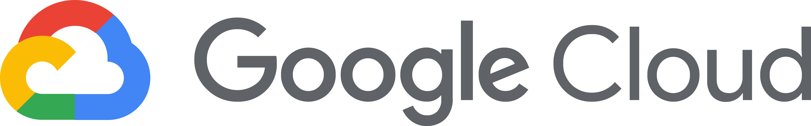

   

## Guia-Cloud > GCP
> Objetivo deste guia é consolidar tudo relacionado a conhecimento no mundo de Google Cloud, e ser um guia de referência para profissionais que já estão atuando na área como tambem para novos profissionais! 

## ⚠️ Aviso importante

>Conteúdo em Construção!  Se você tem algum conteúdo que possa agregar, compartilhe conosco!

## ⌛ STATUS Serviços Google Cloud - [Link Status Serviços Google](https://status.cloud.google.com/?hl=pt-br)

## 📙 MELHORES PRÁTICAS
   #### - CAF (Cloud Adoption Framework) - [Link Documentação Google](https://cloud.google.com/adoption-framework?hl=pt-br)
   #### - Convenção de nomenclatura - [Link Definição de nomenclatura Google Services](https://cloud.google.com/compute/docs/naming-resources?hl=pt-br)
   
## 📗 CALCULADORA de Preços Azure Cloud
   - [Link Calculadora Google Cloud](https://cloud.google.com/products/calculator?hl=pt-br)

## 📘 Treinamentos Oficiais
   - [Link Google Learn](https://cloud.google.com/learn/training?hl=pt-BR)

## 🏆 Certificações GCP
   - [Link Cloud Digital Leader](https://cloud.google.com/learn/certification/cloud-digital-leader?hl=pt-br)
   - [Link Associate Cloud Engineer](https://cloud.google.com/learn/certification/cloud-engineer?hl=pt-br)
   - [Link Professional Cloud Architect](https://cloud.google.com/learn/certification/cloud-architect?hl=pt-br)
   - [Link Professional Cloud DevOps Engineer](https://cloud.google.com/learn/certification/cloud-devops-engineer?hl=pt-br)

## 📒 Treinamentos Free

## 🍺 CONTEÚDOS COMPLEMENTARES
   
## 📂 SITES / BLOGS RELACIONAODS

## 📂 CANAIS NO YOUTUBE COM CONTEÚDO CLOUD

## 📁 LIVROS

  > Official Google Cloud Certified **Associate Cloud Engineer - Study Guide**
  > Official Google Cloud Certified **Profissional Cloud Architect - Study Guide**
